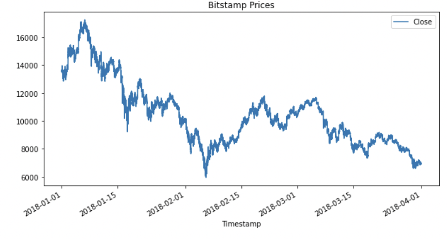
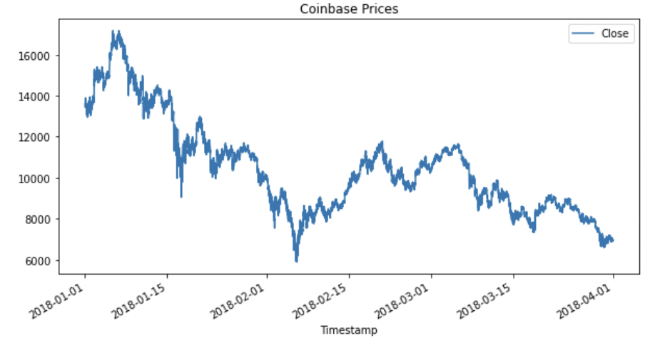
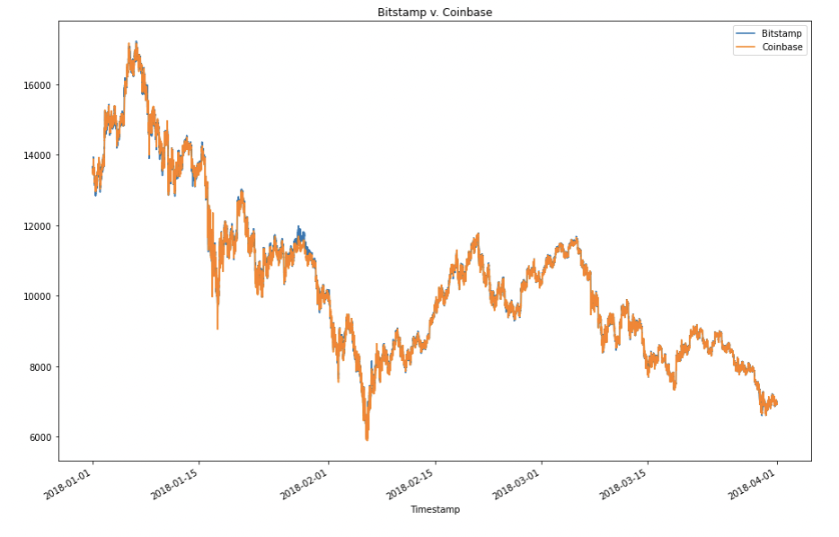
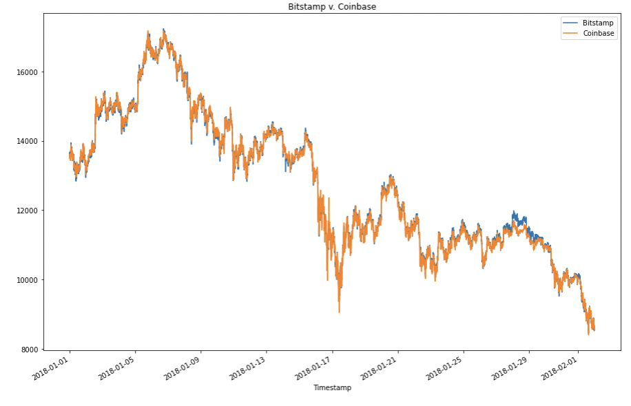
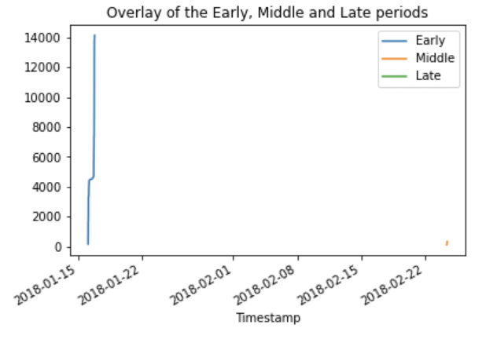

# Quantity Analysis
The following analysis was conducted on jupyter notebook using python.

**Analysis Objective:**

The following is an explanation of my work on the activity called "Quantity Analysis" where I compare Bitstamp and Coinbase and try to identify on which period of the day (early, middle, late) you can breakeven or make a profit. 

On the first image, you can see a graphic for the closed Bitstamp coin prices. 

The second image you can se a graphic for the closed Coinbase coin prices.

The following image is how bitstamp and coinbase looks when you overlay them.

And here at a different dates:

As you can see the blue at somepoint on the image reaches a higher level price,and this is where most of my analys will focus. Trying to find the edge on one coin over the other so that we can make either breakeven or a profit through arbitrage. 

**Results**
After going over specific periods of day, I can conclude that there is a profit early in the day and middle in the date. As for late in the day, I was not able to find a profit. I believe that this happens because at point there is a decrease of volume, and a increase of volumes during early day.
The followung image consist of my conclusion, where I put together the a grapgh where I overlay the cumulative sum of profits through early in the day,middle and late.

My final thoughts consist of that through the period of analysis the most profitable time are during early in the day, and some profit can be found in the middle of the date.

# Technologies
In order for you to run the code you will need jupyter notebook.

